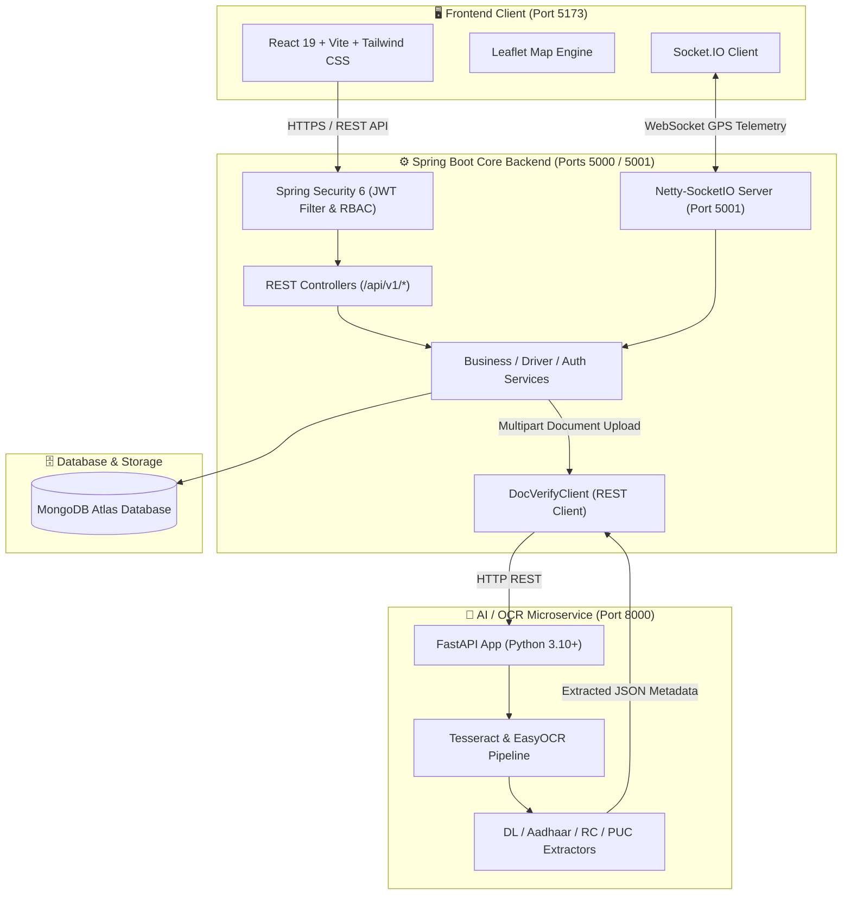

# 🚛 Smart Logistics Platform
### *AI-Powered Freight Marketplace, Return-Load Optimization & Real-Time Fleet Tracking*

[](https://jdk.java.net/21/)
[](https://spring.io/projects/spring-boot)
[](https://react.dev/)
[](https://vitejs.dev/)
[](https://fastapi.tiangolo.com/)
[](https://www.mongodb.com/atlas)
[](https://socket.io/)
[](https://tailwindcss.com/)
[](https://www.docker.com/)
[](https://opensource.org/licenses/MIT)

---

## 📌 Table of Contents
- [Overview & The Return-Trip Problem](#-overview--the-return-trip-problem)
- [Key Features](#-key-features)
- [System Architecture](#-system-architecture)
- [Tech Stack](#-tech-stack)
- [Repository Structure](#-repository-structure)
- [Getting Started & Local Setup](#-getting-started--local-setup)
  - [Prerequisites](#prerequisites)
  - [Environment Variables (.env)](#environment-variables-env)
  - [Option 1: Quickstart with Docker Compose](#option-1-quickstart-with-docker-compose)
  - [Option 2: Running Services Individually](#option-2-running-services-individually)
- [API & Real-Time Socket Specifications](#-api--real-time-socket-specifications)
  - [REST API Endpoints](#rest-api-endpoints)
  - [Netty-SocketIO Events](#netty-socketio-events)
- [AI Document Verification (OCR Microservice)](#-ai-document-verification-ocr-microservice)
- [Testing & Quality Assurance](#-testing--quality-assurance)
- [Security & Best Practices](#-security--best-practices)
- [Roadmap](#-roadmap)
- [Contributing & License](#-contributing--license)

---

## 📖 Overview & The Return-Trip Problem

In the modern freight and supply chain industry, commercial truck drivers often face high operating costs due to **deadhead miles**—the journey back to origin with an empty trailer after delivering cargo. 

**Smart Logistics Platform** solves this fundamental logistics inefficiency by providing an open, real-time marketplace engineered for **return-load discovery and optimization**:

1. **Businesses** post shipments and load requirements specifying origin, destination, cargo type, tonnage, and budget.
2. **Truck Drivers** search for matching freight along their return routes and place competitive bids.
3. **Automated Contracts & Live Execution**: Once a bid is accepted, an active trip is initiated with turn-by-turn **real-time GPS streaming** and milestone verification.
4. **Instant Onboarding**: Trust is established instantly via an automated **AI-powered OCR microservice** that validates driver licenses, vehicle RCs, PUCs, insurance policies, and permits.

---

## 🌟 Key Features

### 📦 1. Return-Load Marketplace & Competitive Bidding
- Multi-parameter load discovery (route origin/destination, cargo weight, freight category, pricing).
- Dynamic bidding mechanism allowing drivers to negotiate and quote competitive rates.
- Multi-bid comparison dashboard for businesses to evaluate drivers based on rate, ratings, and vehicle compliance.

### 📍 2. High-Performance Real-Time GPS Tracking
- Powered by high-throughput **Netty-SocketIO (port 5001)** for non-blocking telemetry streaming.
- Room-based pub/sub architecture (`tripId` rooms) ensuring low latency updates between drivers and tracking businesses.
- Real-time **Leaflet interactive map** visualizing driver breadcrumbs, speed, timestamps, and route milestones.
- Immutable location history stored in MongoDB for trip auditing and delivery dispute resolution.

### 🤖 3. AI-Powered OCR Document Verification
- Autonomous KYC and vehicle compliance pipeline running on a dedicated **FastAPI Python microservice (port 8000)**.
- Dual-engine OCR with **PyTesseract** and **EasyOCR** for Indian identification and vehicular documents.
- Automatic extraction and verification for:
  - **Identity**: Aadhaar Card (front/back), Driving License (DL).
  - **Fleet Compliance**: Registration Certificate (RC), Pollution Under Control (PUC), Commercial Insurance, State & National Carriage Permits.

### 👥 4. Role-Based Access Control (RBAC) & Enterprise Security
- Stateless **Spring Security 6** architecture secured with **JWT (JSON Web Tokens)**.
- Strictly isolated workflows for:
  - **Truck Drivers**: Fleet management, load discovery, bidding, live trip execution.
  - **Businesses**: Load creation, bid acceptance, real-time tracking, proof of delivery confirmation.
  - **Platform Admins**: System-wide auditing, manual verification overrides, platform analytics.

### 🌐 5. Modern UI & Localization (i18n)
- Responsive frontend built with **React 19**, **Vite**, and **Tailwind CSS**.
- Multi-language support (**English**, **Hindi**, and regional languages) through `i18next` to empower truck drivers across diverse regions.

---

## 🏗 System Architecture



---

## 💻 Tech Stack

| Layer | Technologies |
|---|---|
| **Frontend** | React 19, Vite, Tailwind CSS, Leaflet Maps, Axios, Lucide React, i18next, Socket.io-client |
| **Backend Core** | Java 21, Spring Boot 3.3.4, Spring Security 6, Spring Data MongoDB, Lombok, Dotenv Java |
| **Real-time Server** | Netty-SocketIO 2.0.12 (Asynchronous event-driven network application framework) |
| **AI / OCR Microservice** | Python 3.10+, FastAPI, Uvicorn, PyTesseract, EasyOCR, Pillow, PDFPlumber, Pydantic v2 |
| **Database** | MongoDB Atlas (Multi-document collections, indexes, and location history) |
| **DevOps & Containerization** | Docker, Docker Compose, Multi-Stage Builds |

---

## 📂 Repository Structure

```
smart-logistics/
├── docker-compose.yml                     # Unified multi-container deployment
├── PROJECT_CONTEXT.md                     # Platform specification & context
├── PROJECT_PROGRESS.md                    # Roadmap & engineering milestones
├── FRONTEND_API_MAP.md                    # Detailed frontend-to-backend API contract
│
├── smart-logistics-backend/              # ☕ Spring Boot Java 21 Backend
│   ├── src/main/java/com/smartlogistics/
│   │   ├── client/                        # RestClient for FastAPI OCR service
│   │   ├── config/                        # Mongo & Jackson custom deserializers
│   │   ├── controller/                    # Auth, Driver, Business, Admin controllers
│   │   ├── dto/                           # Request & response transfer objects
│   │   ├── exception/                     # Global exception handler & error schemas
│   │   ├── model/                         # MongoDB document entities
│   │   ├── repository/                    # Spring Data MongoDB repositories
│   │   ├── security/                      # JWT token provider & security filter chain
│   │   ├── service/                       # Core business logic layer
│   │   ├── socket/                        # Netty-SocketIO GPS location handlers & config
│   │   └── SmartLogisticsApplication.java # Application entry point with .env loader
│   ├── src/main/resources/
│   │   └── application.yml                # Configuration file driven by .env
│   ├── src/test/                          # JUnit 5 & Mockito test suites
│   ├── .env.example                       # Backend environment template
│   ├── Dockerfile                         # Production multi-stage Docker build
│   └── pom.xml                            # Maven dependencies & build configuration
│
├── smart-logistics-frontend/             # ⚛️ React 19 + Vite Frontend
│   ├── src/
│   │   ├── components/                    # Modals, Navbar, ProtectedRoute, Map widgets
│   │   ├── context/                       # AuthContext & Language state
│   │   ├── i18n/                          # Internationalization translations (EN, HI)
│   │   ├── pages/                         # Driver/Business dashboards, Loads, Bids, Tracking
│   │   ├── services/                      # Axios API clients & Socket.IO handlers
│   │   ├── App.jsx                        # React Router layout
│   │   └── main.jsx                       # Frontend entry point
│   ├── package.json                       # NPM dependencies
│   ├── tailwind.config.js                 # Tailwind CSS styling design system
│   └── vite.config.js                     # Vite build configuration
│
└── doc_verify_service/                   # 🐍 FastAPI AI/OCR Microservice
    ├── app/
    │   ├── ai/                            # OCR image processing & text normalization
    │   ├── api/                           # Verification endpoints for DL, Aadhaar, RC, PUC
    │   ├── core/                          # Security & service logging
    │   ├── schemas/                       # Pydantic request/response schemas
    │   ├── services/                      # Document verification logic
    │   ├── config.py                      # Microservice configuration
    │   └── main.py                        # FastAPI application entry point
    ├── requirements.txt                   # Python dependencies
    └── Dockerfile                         # Python OCR container definition
```

---

## 🚀 Getting Started & Local Setup

### Prerequisites
Make sure you have the following installed on your machine:
- **Java 21+** (JDK 21 or later)
- **Apache Maven 3.9+**
- **Node.js 18+** & **npm**
- **Python 3.10+** (with `pip`)
- **Tesseract OCR engine** (for OCR service)
- **MongoDB Atlas** cluster URI or local MongoDB instance

---

### Environment Variables (`.env`)

#### 1. Backend Configuration (`smart-logistics-backend/.env`)
Create `smart-logistics-backend/.env` (or copy from `.env.example`):
```properties
# Backend Server Settings
PORT=5000
NODE_ENV=development
LOG_LEVEL=info

# Database Configuration
MONGO_URI=mongodb+srv://<username>:<password>@cluster0.mongodb.net/?retryWrites=true&w=majority
MONGO_DATABASE=smart_logistics

# Authentication & Security
JWT_SECRET=your_super_secret_jwt_key_that_is_at_least_32_characters_long!
JWT_EXPIRES_IN_MS=604800000
JWT_EXPIRES_IN=7d

# CORS & Domain Settings
CORS_ORIGINS=http://localhost:5173,http://localhost:3000
CLIENT_ORIGIN=http://localhost:5173

# Socket.IO Real-time Server
SOCKET_HOST=0.0.0.0
SOCKET_PORT=5001

# External Microservice URLs
DOC_VERIFY_SERVICE_URL=http://localhost:8000
```

#### 2. OCR Service Configuration (`doc_verify_service/.env`)
Create `doc_verify_service/.env`:
```properties
APP_NAME=SmartLogistics-DocVerify
PORT=8000
HOST=0.0.0.0
LOG_LEVEL=info
TESSERACT_CMD=tesseract # or absolute path on Windows: C:\Program Files\Tesseract-OCR\tesseract.exe
```

---

### Option 1: Quickstart with Docker Compose

Launch the entire ecosystem (Backend + OCR Microservice) with a single command:

```bash
# Clone the repository
git clone https://github.com/suyogpunde0411/smart-logistics.git
cd smart-logistics

# Start backend and AI services with Docker Compose
docker compose up --build
```

In a separate terminal, launch the frontend:
```bash
cd smart-logistics-frontend
npm install
npm run dev
```

---

### Option 2: Running Services Individually

#### 1. Start the AI Document Verification Service (FastAPI)
```bash
cd doc_verify_service
python -m venv venv
# On Windows:
.\venv\Scripts\activate
# On Linux/macOS:
source venv/bin/activate

pip install -r requirements.txt
uvicorn app.main:app --host 0.0.0.0 --port 8000 --reload
```
*Verification service available at `http://localhost:8000` (Swagger UI: `http://localhost:8000/docs`)*

#### 2. Start the Core Backend (Spring Boot)
```bash
cd smart-logistics-backend
mvn clean spring-boot:run
```
*Core REST API available at `http://localhost:5000/api/v1` and Netty-SocketIO at `http://localhost:5001`*

#### 3. Start the Frontend (React + Vite)
```bash
cd smart-logistics-frontend
npm install
npm run dev
```
*Frontend will be running at `http://localhost:5173`*

---

## 📡 API & Real-Time Socket Specifications

### REST API Endpoints

#### 🔐 Authentication & Accounts (`/api/v1/auth`)
| Method | Endpoint | Description | Auth Required |
|---|---|---|---|
| `POST` | `/api/v1/auth/register` | Register Driver or Business account | No |
| `POST` | `/api/v1/auth/login` | Login and obtain JWT token | No |

#### 🚚 Driver Workflows (`/api/v1/driver`)
| Method | Endpoint | Description | Auth Required |
|---|---|---|---|
| `GET` | `/api/v1/driver/profile` | Get driver profile and KYC verification status | Role: `DRIVER` |
| `PUT` | `/api/v1/driver/profile` | Update driver personal and contact details | Role: `DRIVER` |
| `GET` | `/api/v1/driver/trucks` | List all registered trucks in driver's fleet | Role: `DRIVER` |
| `POST` | `/api/v1/driver/trucks` | Register a new truck with capacity specifications | Role: `DRIVER` |
| `PUT` | `/api/v1/driver/trucks/:id` | Update truck details | Role: `DRIVER` |
| `DELETE` | `/api/v1/driver/trucks/:id` | Remove a truck from fleet | Role: `DRIVER` |
| `GET` | `/api/v1/driver/loads/open` | Search and filter open loads on return route | Role: `DRIVER` |
| `POST` | `/api/v1/driver/loads/:loadId/bids` | Submit a bid quote for a specific load | Role: `DRIVER` |
| `GET` | `/api/v1/driver/bids` | View all bids placed by the driver | Role: `DRIVER` |
| `GET` | `/api/v1/driver/trips` | View assigned active and past trips | Role: `DRIVER` |
| `GET` | `/api/v1/driver/trips/:id` | Fetch specific trip details with cargo specs | Role: `DRIVER` |

#### 🏢 Business Workflows (`/api/v1/business`)
| Method | Endpoint | Description | Auth Required |
|---|---|---|---|
| `GET` | `/api/v1/business/profile` | Retrieve business company profile | Role: `BUSINESS` |
| `PUT` | `/api/v1/business/profile` | Update company profile information | Role: `BUSINESS` |
| `POST` | `/api/v1/business/loads` | Create and post a new freight load requirement | Role: `BUSINESS` |
| `GET` | `/api/v1/business/loads` | List all loads posted by the business | Role: `BUSINESS` |
| `PUT` | `/api/v1/business/loads/:id/cancel` | Cancel an open load | Role: `BUSINESS` |
| `GET` | `/api/v1/business/loads/:loadId/bids`| List all bids submitted for a load | Role: `BUSINESS` |
| `PUT` | `/api/v1/business/bids/:bidId/accept`| Accept bid (assigns driver & initiates Trip) | Role: `BUSINESS` |
| `PUT` | `/api/v1/business/bids/:bidId/reject`| Reject a driver's bid | Role: `BUSINESS` |
| `GET` | `/api/v1/business/trips` | View all active and completed business trips | Role: `BUSINESS` |
| `GET` | `/api/v1/business/trips/:id/history`| Retrieve full GPS coordinate history of trip | Role: `BUSINESS` |

---

### Netty-SocketIO Events

| Emitter | Event Name | Payload Format | Description |
|---|---|---|---|
| **Driver** | `driver:start_trip` | `{ "tripId": "..." }` | Marks Trip `IN_TRANSIT`, joins driver to room, broadcasts `trip:started`. |
| **Driver** | `driver:location_update` | `{ "tripId": "...", "latitude": 18.52, "longitude": 73.85, "speed": 45.2, "heading": 180.0 }` | Persists point in MongoDB; broadcasts `location:update` to room. |
| **Business** | `business:join_trip_room` | `{ "tripId": "..." }` | Joins business client to live trip room; receives latest location. |
| **Business** | `business:confirm_delivery` | `{ "tripId": "..." }` | Marks Trip `DELIVERED`, broadcasts `trip:ended`, closes telemetry channel. |

---

## 🔍 AI Document Verification (OCR Microservice)

The **Document Verification Microservice** automatically parses images and PDF documents to accelerate driver and vehicle onboarding while combating fraud:

```
Driver Uploads Docs ──► Spring Boot API ──► FastAPI OCR Pipeline ──► Validation & Score ──► Driver Verified ✅
```

### Supported Documents & Validation Fields:
- **Driving License (DL)**: License number, Driver name, Validity date, Vehicle class endorsements.
- **Aadhaar Card**: 12-digit UID masking, Name, DOB, Gender, Address extraction.
- **Vehicle RC**: Registration number, Chassis number, Engine number, Vehicle class, Gross vehicle weight (GVW).
- **PUC Certificate**: Emission norms compliance, Test date, Expiry validity.
- **Commercial Insurance**: Policy number, Insurer name, Active coverage window.
- **State / National Permit**: Permit authorization number, All-India validity dates.

---

## 🧪 Testing & Quality Assurance

### Run Core Backend Tests (JUnit 5 & Mockito)
```bash
cd smart-logistics-backend
mvn clean test
```

### Run OCR Microservice Tests (PyTest)
```bash
cd doc_verify_service
pytest tests/ -v
```

### Run Frontend Code Linter
```bash
cd smart-logistics-frontend
npm run lint
```

---

## 🔒 Security & Best Practices

- **Zero Credential Leaks**: All database passwords, tokens, and secrets are strictly decoupled from source code and injected through `.env`.
- **JWT Stateless Authentication**: Uses cryptographically signed HMAC-SHA256 tokens with configurable expiration and RBAC guards.
- **Throttled Telemetry Ingestion**: High-frequency GPS updates are validated and throttled to prevent socket saturation and database bottlenecks.
- **File Upload Protection**: Enforced file size quotas (15MB per file, 30MB per request) and MIME-type verification on all document uploads.

---

## 🗺️ Roadmap

- [ ] **Predictive Price Recommendation**: Machine learning pricing engine analyzing historical route demand, diesel prices, and tonnage.
- [ ] **Automated FASTag / Toll Tracking**: Toll plaza API integration for estimated time of arrival (ETA) enhancement.
- [ ] **Mobile Driver Companion App**: Native React Native / Flutter mobile build with background GPS telemetry.
- [ ] **Automated Invoicing & Escrow Payments**: Integration with payment gateways (Stripe / Razorpay) for milestone-based fund releases.

---

## 🤝 Contributing & License

Contributions, issues, and feature requests are welcome!

1. Fork the repository
2. Create your feature branch (`git checkout -b feature/AmazingFeature`)
3. Commit your changes (`git commit -m 'Add some AmazingFeature'`)
4. Push to the branch (`git push origin feature/AmazingFeature`)
5. Open a Pull Request

Distributed under the **MIT License**. See `LICENSE` for more information.

---

<p align="center">
  Built with ❤️ for smarter, greener, and efficient logistics.
</p>
