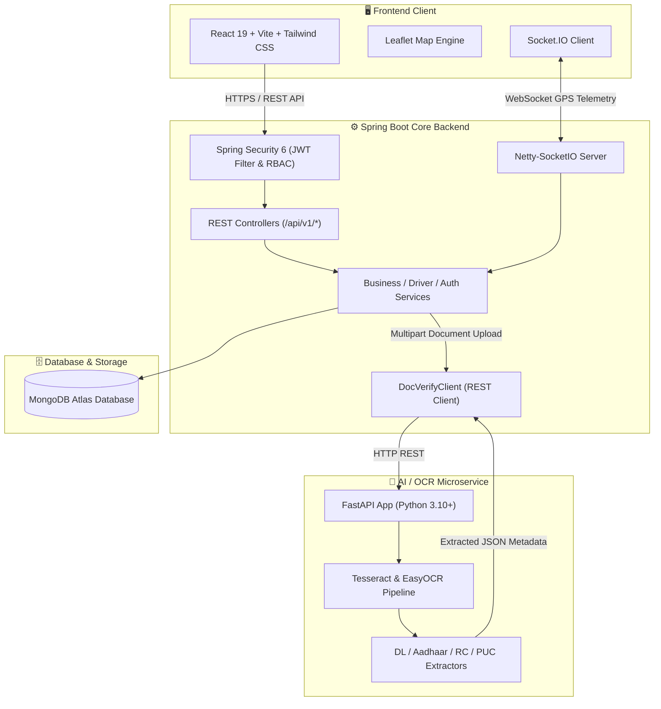

# 🚛 Smart Logistics Platform
### *AI-Powered Freight Marketplace, Return-Load Optimization & Real-Time Fleet Tracking*

[](https://jdk.java.net/21/)
[](https://spring.io/projects/spring-boot)
[](https://react.dev/)
[](https://vitejs.dev/)
[](https://fastapi.tiangolo.com/)
[](https://www.mongodb.com/atlas)
[](https://socket.io/)
[](https://tailwindcss.com/)
[](https://www.docker.com/)
[](https://opensource.org/licenses/MIT)

---

## 📌 Table of Contents
- [Overview & The Return-Trip Problem](#-overview--the-return-trip-problem)
- [Key Features](#-key-features)
- [System Architecture](#-system-architecture)
- [Tech Stack](#-tech-stack)
- [AI Document Verification Pipeline](#-ai-document-verification-pipeline)

---

## 📖 Overview & The Return-Trip Problem

In the modern freight and supply chain industry, commercial truck drivers often face high operating costs due to **deadhead miles**—the journey back to origin with an empty trailer after delivering cargo. 

**Smart Logistics Platform** solves this fundamental logistics inefficiency by providing an open, real-time marketplace engineered for **return-load discovery and optimization**:

1. **Businesses** post shipments and load requirements specifying origin, destination, cargo type, tonnage, and budget.
2. **Truck Drivers** search for matching freight along their return routes and place competitive bids.
3. **Automated Contracts & Live Execution**: Once a bid is accepted, an active trip is initiated with turn-by-turn **real-time GPS streaming** and milestone verification.
4. **Instant Onboarding**: Trust is established instantly via an automated **AI-powered OCR microservice** that validates driver licenses, vehicle RCs, PUCs, insurance policies, and permits.

---

## 🌟 Key Features

### 📦 1. Return-Load Marketplace & Competitive Bidding
- Multi-parameter load discovery (route origin/destination, cargo weight, freight category, pricing).
- Dynamic bidding mechanism allowing drivers to negotiate and quote competitive rates.
- Multi-bid comparison dashboard for businesses to evaluate drivers based on rate, ratings, and vehicle compliance.

### 📍 2. High-Performance Real-Time GPS Tracking
- Powered by high-throughput **Netty-SocketIO** for non-blocking telemetry streaming.
- Room-based pub/sub architecture (`tripId` rooms) ensuring low latency updates between drivers and tracking businesses.
- Real-time **Leaflet interactive map** visualizing driver breadcrumbs, speed, timestamps, and route milestones.
- Immutable location history stored in MongoDB for trip auditing and delivery dispute resolution.

### 🤖 3. AI-Powered OCR Document Verification
- Autonomous KYC and vehicle compliance pipeline running on a dedicated **FastAPI Python microservice**.
- Dual-engine OCR with **PyTesseract** and **EasyOCR** for Indian identification and vehicular documents.
- Automatic extraction and verification for:
  - **Identity**: Aadhaar Card (front/back), Driving License (DL).
  - **Fleet Compliance**: Registration Certificate (RC), Pollution Under Control (PUC), Commercial Insurance, State & National Carriage Permits.

### 👥 4. Role-Based Access Control (RBAC) & Enterprise Security
- Stateless **Spring Security 6** architecture secured with **JWT (JSON Web Tokens)**.
- Strictly isolated workflows for:
  - **Truck Drivers**: Fleet management, load discovery, bidding, live trip execution.
  - **Businesses**: Load creation, bid acceptance, real-time tracking, proof of delivery confirmation.
  - **Platform Admins**: System-wide auditing, manual verification overrides, platform analytics.

### 🌐 5. Modern UI & Localization (i18n)
- Responsive frontend built with **React 19**, **Vite**, and **Tailwind CSS**.
- Multi-language support (**English**, **Hindi**, and regional languages) through `i18next` to empower truck drivers across diverse regions.

---

## 🏗 System Architecture



---

## 💻 Tech Stack

| Layer | Technologies |
|---|---|
| **Frontend** | React 19, Vite, Tailwind CSS, Leaflet Maps, Axios, Lucide React, i18next, Socket.io-client |
| **Backend Core** | Java 21, Spring Boot 3.3.4, Spring Security 6, Spring Data MongoDB, Lombok, Dotenv Java |
| **Real-time Server** | Netty-SocketIO 2.0.12 (Asynchronous event-driven network application framework) |
| **AI / OCR Microservice** | Python 3.10+, FastAPI, Uvicorn, PyTesseract, EasyOCR, Pillow, PDFPlumber, Pydantic v2 |
| **Database** | MongoDB Atlas (Multi-document collections, indexes, and location history) |
| **DevOps & Containerization** | Docker, Docker Compose, Multi-Stage Builds |

---

## 🔍 AI Document Verification Pipeline

The **Document Verification Microservice** automatically parses identity and vehicular documents to accelerate driver onboarding while preventing fraud:

```
Driver Uploads Docs ──► Spring Boot API ──► FastAPI OCR Pipeline ──► Validation & Score ──► Driver Verified ✅
```

### Supported Documents & Validations:
- **Driving License (DL)**: License number, driver name, validity dates, vehicle class endorsements.
- **Aadhaar Card**: 12-digit UID masking, name, DOB, gender, and address extraction.
- **Vehicle RC**: Registration number, chassis number, engine number, vehicle class, and gross vehicle weight (GVW).
- **PUC Certificate**: Emission norms compliance, test date, and expiry validity.
- **Commercial Insurance**: Policy number, insurer name, and active coverage window.
- **State / National Permits**: Permit authorization number and All-India validity dates.

---

<p align="center">
  Built with ❤️ for smarter, greener, and efficient logistics.
</p>
